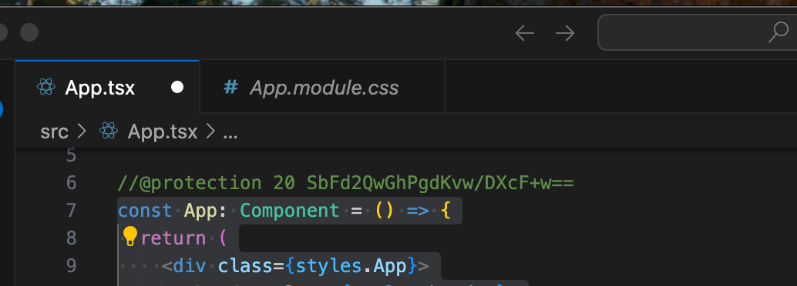

# vscode-eslint-protected

The extension `vscode-eslint-protected` lets you add special comments with hashes that the [`eslint-protection`](https://github.com/crabnebula-dev/eslint-protection) can then use to detect unconscious code changes.



## Adding `@crabnebula/eslint-protection` to your project

If you have not already, add `eslint` and `@crabnebula/eslint-protection` to your project:

```sh
npm add --save-dev eslint @crabnebula/eslint-protection
# or
yarn add -D eslint @crabnebula/eslint-protection
# or
pnpm add -D eslint @crabnebula/eslint-protection
```

Now configure `eslint` to use the plugin in `eslint.config.mjs`:

```js
import { defineConfig } from "eslint/config";
import protection from "@crabnebula/eslint-protection";

export default defineConfig({    
    plugins: { protection },
    rules: {
        "protection/protect": "error"
    }
});
```

Ideally, you set up `eslint` as a guarding mechanism for commits using e.g. `husky`; first, install the required dependencies:

```sh
npm add --save-dev husky lint-staged @crabnebula/husky-protection
# or
yarn add -D husky lint-staged @crabnebula/husky-protection
# or
pnpm add -D husky lint-staged @crabnebula/husky-protection
```

Next, initialize Husky:

```sh
npx husky-init && npm install
# or
npx husky-init && yarn
# or
pnpx husky-init && pnpm i
```

Lastly, add a pre-commit hook:

```sh
npx husky add .husky/pre-commit "npx lint-staged"
npx husky add .husky/pre-commit "node_modules/@crabnebula/husky-protection/index.js"
# or
pnpx husky add .husky/pre-commit "npx lint-staged"
pnpx husky add .husky/pre-commit "node_modules/@crabnebula/husky-protection/index.js"

# in either case, make it executable:
chmod +x .husky/pre-commit .husky/_/husky.sh
```

This will add the linter and another protection commit hook that will block commits that remove more protection comments than they add.

## Select lines to protect

* Command: `eslint-protect.selected`
* Keyboard binding (Windows/Linux): <kbd>Ctrl</kbd> + <kbd>Alt</kbd> + <kbd>l</kbd>
* Keyboard binding (Mac): <kbd>Ctrl</kbd> + <kbd>Command</kbd> + <kbd>l</kbd>

If no selection is made, the command will create a comment to protect a single line. For a selection, the full lines the selection is touching will be protected.

## Protect a whole file

* Command: `eslint-protect.file`
* Keyboard binding (Windows/Linux): <kbd>Shift</kbd> + <kbd>Ctrl</kbd> + <kbd>Alt</kbd> + <kbd>l</kbd>
* Keyboard binding (Mac): <kbd>Shift</kbd> + <kbd>Ctrl</kbd> + <kbd>Command</kbd> + <kbd>l</kbd>

This command will create a comment at the top that protects the whole file.
